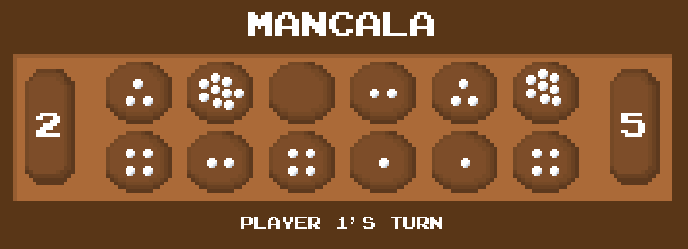

 
# Mancala
First time building a GUI with C++ using SDL2

## Description
* A classic game, Mancala is played with 2 players on a board with 12 pits, each of which starts with 4 stones, and 2 Mancalas. The object of the game is to get the most stones into your mancala. 

  

## Instructions
* Copy the repository onto your local machine and run `bin/exec` in the terminal to play the latest version.
* Player 1 goes first, owning the bottom row of pits while Player 2 owns the top row.
* The game ends when one Player's side is completely empty.

## Version History
* 1.1
    * Added splash screen and end screen
* 1.0
    * Initial Release

## Dependencies
* SDL2
    * SDL_image
    * SDL_ttf

## Acknowledgements
* Gregory Lee for being an awesome and inspiring TA
* [Lazy Foo' Productions](http://www.lazyfoo.net/tutorials/SDL/index.php)
* [codergopher](https://www.youtube.com/playlist?list=PL2RPjWnJduNmXHRYwdtublIPdlqocBoLS)
* [John Hammond](https://www.youtube.com/playlist?list=PL1H1sBF1VAKXMz8kETLHRo1LwnvB08Q2J)
